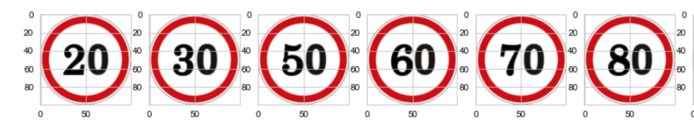
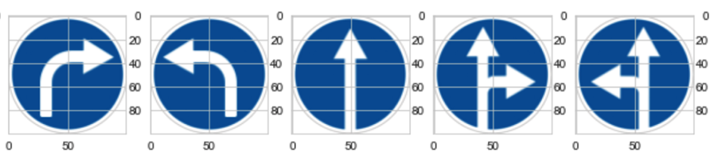

# ImageClustering_J7project
This is jiaojiao's independent work for J7project, the deep clustering task of traffic signs.

One can review the summary of literature and also the experiments at the following link(**references of literature and code are also attached in the end**):

https://github.com/JIAOJIAOMEI/ImageClustering_J7project/blob/main/Summary/summary_v6fisc.md

here is a pdf version of the summary with **table of contents**, please find it at the link:

https://github.com/JIAOJIAOMEI/ImageClustering_J7project/blob/main/Summary/summary_v6fisc.pdf

One can find the code and the dataset in this file:

https://github.com/JIAOJIAOMEI/ImageClustering_J7project/tree/main/Code

**Before get into the details, here is a short descrption of my work**:

For machine learning methods, I tried 1. pure K-means; 2.transfer learning+K-means; 3.Agglomerative clustering + PCA with 4 different linkages.

For deep learning methods, I tried several ways to implement autoencoders, which are 1.simple autoencoders; 2.Multiplayer auto encoders; 3. Convolutional autoencoders and 4. Regularized autoencoders.

- Pure K-means received the accuracy at 18%.
- Transfer learning does not improve pure K-means, the pertained model I used is ResNet50, this model is trained on ImageNet which contains most natrual images, not by our case (traffic signs). Although it does not improve the accuracy, it does not decrease it either.
- I tried single linkage, ward linkage, centroid linkage and complete linkage when using Agglomerative clustering + PCA method. I think ward linkage performs the best outcome between these 4, and better than pure Kmeans, also better than transfer learning. The evidence is that the 43 centers produced by ward linkage are most different from each other.
- Among all the 4 autoencoders I tried, I think the performance are organized as the following: multilayer autoencoders>simple autoencoders>regularized autoencoders>convolutional autoencoders. The convolutional auto encoders I tried cannot give any useful information at all, maybe the training data is not enough, or maybe somewhere I made a mistake. The convolutional autoencoders is the most complicated autoencoders, but it fails to meet my expectation.
- Deep learning methods are not necessarily better than machine learning methods in a specific situation, it depends on many factors, for example, the coding ability of who implements it, or GPU resources, or the level of feature extraction, or the understanding of the task.

The reason why I choose K-means and Agglomerative clustering, is simply because that they produce results like "one picture can only be in one class", this is very important. Our dataset is about traffic signs, these classes are strongly independent, either it belongs to this category, or it belongs to another category. Another reason is that these methods are easily to be implemented.

Although the classes/categories are strongly independent, the pictures are not that kind of independent. For example, the following pictures do have something in common. This is what makes the task difficult. Machine learning methods can learn the shapes and the colors, but fails to learn the details like "2","3","5", and something like this.

The reason why I choose autoencoders, is also simple. There are 3 ways: 1. Feed-forward networks; 2. autoencoders (a type of feed-forward networks designed for clustering); 3. GAN & VAE. It seems like two ways are about feed-forward networks, and autoencoders are designed for this. Then, I tried autoenders. I think GAN & VAE are also very interesting, maybe next time I will try. 😂
