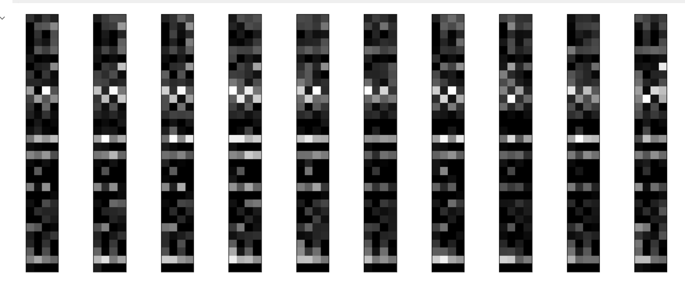

[TOC]

# Task

Deep Clustering for Unsupervised Image Classification

# Literature review

## Project details

**Project number**: J7 

**Project name**: Deep Clustering for Unsupervised Image Classification

**Dataset**: GTSRB - German Traffic Sign Recognition Benchmark

**Team member**: Besson Sacha; Capdeville Jérémie; Arriagada Silva Sebastián Ignacio; **Mei Jiaojiao**;

## Dataset details

The German Traffic Sign Recognition Benchmark (GTSRB)[1] is a dataset of traffic sign images used for evaluating the performance of image recognition algorithms. The dataset contains more than 50,000 images of 43 different traffic signs, including stop signs, speed limit signs, and warning signs. The images were collected from various sources, including web cameras, and are annotated with the type of traffic sign and the location of the sign in the image. The GTSRB dataset is widely used in the computer vision and machine learning communities for training and evaluating algorithms for traffic sign recognition. It is also used as a benchmark for comparing the performance of different algorithms. The GTSRB dataset is publicly available for research purposes and can be downloaded from the official website.

- 43 categories, ramdom guess = 2.32%
- class imbalance (43 categories), the following picture shows the number of images per class


Class imbalance [2-4] refers to a situation where the number of samples in one or more classes is much smaller than the number of samples in other classes. This can occur when the data used for training a model is not representative of the real-world distribution of the classes. In such cases, the model may be biased towards the majority class and perform poorly on the minority class, leading to a high error rate.

**Class imbalance can be tackled by several ways** [5-13]:

- Over-sampling [7-8] the minority class by generating synthetic samples. This method involves creating new samples by slightly modifying existing minority class samples, or by combining them with other samples. This can increase the number of samples in the minority class and make it more similar in size to the majority class.
- Under-sampling [7-8] the majority class by removing some of its samples. This method involves removing samples from the majority class to make it more similar in size to the minority class. This can help balance the dataset and prevent the model from being biased towards the majority class.
- Using a different evaluation metric [9-10] such as **F1-score**, which takes into account both precision and recall, instead of accuracy. This can help to give a more realistic picture of the model's performance when dealing with imbalanced datasets.
- Using ensemble methods such as cost-sensitive learning [11-12] or using different weighting in the loss function. This can help to adjust the model's decision threshold, or change the importance given to each class in the training process, in order to reduce the impact of class imbalance.
- Using **data augmentation** [13] techniques, to artificially increase the dataset by creating new samples through image transformation, rotation, crop, and other techniques.

It's important to note that not all methods are suitable for every dataset and you may need to try multiple methods and see which works best.

## Machine learning Clustering methods

### K-means

K-means is a clustering algorithm used to group similar data points together. It is a type of unsupervised machine learning algorithm, **meaning that it is used to discover patterns in data without the need for labeled examples**.[14-16]

The basic idea behind K-means is to define k clusters, and then assign each data point to the cluster whose mean (centroid) is closest to it. The algorithm iteratively updates the cluster assignments and centroids until convergence, which is reached when the cluster assignments no longer change. [14-16]

Here's the general steps of the K-means algorithm: [14-16]

1. Initialize k centroids, which can be chosen randomly from the data points, or by using some other method.
2. Assign each data point to the cluster whose centroid is closest to it, based on a similarity measure such as Euclidean distance.
3. Update the centroid of each cluster by taking the mean of all the data points assigned to it.
4. Repeat steps 2 and 3 until the cluster assignments no longer change or a certain number of iterations is reached.

K-means is relatively simple and easy to implement, and it can be used for a wide range of applications, such as image compression, anomaly detection, and market segmentation. **However, it can be sensitive to the initialization of the centroids and may converge to a local optimum. [17-18] Also, it assumes that the clusters are spherical and equally sized, which may not always be the case.** (K-means assumes that the clusters are spherical and equally sized because it uses the Euclidean distance as a similarity measure, which is a measure of the straight-line distance between two points in a Euclidean space. This distance measure is only meaningful when the clusters are spherical and equally sized because it assumes that the data points are distributed evenly in all directions around the centroid.)

In addition, K-medoids and Fuzzy k-means are variations of the K-means algorithm that can overcome some of its disadvantages.

**K-medoids**: K-medoids is similar to K-means, but **instead of using the mean of the data points in a cluster as the centroid, it uses one of the data points in the cluster as the medoid**. This allows K-medoids to handle non-numerical data and to be more robust to noise and outliers. Also, it can handle clusters of different shapes and sizes better than K-means.[19-21]

**Fuzzy K-Means**: Fuzzy K-means (also known as soft K-means) is a variation of K-means **that allows each data point to belong to multiple clusters with varying degrees of membership**. It assigns a membership degree to each data point for each cluster, rather than a binary assignment as in K-means. This allows for a more flexible and realistic representation of the data, and can handle clusters of different shapes and sizes better than K-means.[22-23]

It's important to note that these variants may have their own limitations and drawbacks, and it is advisable to try different algorithms and techniques to find the best approach for a specific problem.

### Hierarchical Clustering

Hierarchical Clustering is a method of grouping similar data points into clusters based on their similarity or distance. It builds a hierarchy of clusters by repeatedly merging or splitting clusters.[24-28]

There are two main approaches for hierarchical clustering:[24-28]

1. **Agglomerative**: also known as "bottom-up" approach, it starts with each data point as a separate cluster and then iteratively merges the closest clusters together until all data points are in the same cluster.
2. **Divisive**: also known as "top-down" approach, it starts with all data points in the same cluster and then iteratively splits the cluster into smaller clusters.

Agglomerative hierarchical clustering is more commonly used.

The basic steps of the Agglomerative Hierarchical Clustering are: [29-30]

1. Calculate the pairwise distance between all data points.
2. Start with each data point as an individual cluster.
3. Repeat the following steps until all data points are in the same cluster: a) Merge the two closest clusters. b) Update the distance matrix.
4. Build a dendrogram, which is a tree-like diagram that shows the merging process.

Hierarchical Clustering can be used for a wide range of applications, such as image compression, anomaly detection, and market segmentation. **It can handle clusters of different shapes and sizes and can identify nested clusters or clusters with non-convex shapes**. **However, it can be sensitive to the choice of linkage criteria and distance metric, and it does not scale well to large datasets.**

There are several ways to improve the performance of Hierarchical Clustering:

1. **Choosing an appropriate linkage criterion**: Different linkage criteria, such as single linkage, complete linkage, average linkage, and Ward linkage, can be used to determine the distance between clusters. Each linkage criterion has its own strengths and weaknesses, and the choice of linkage criterion can have a significant impact on the final clustering results. [31]
   
2. **Choosing an appropriate distance metric**: Different distance metrics, such as Euclidean, Manhattan, and Cosine distance, can be used to calculate the similarity between data points. The choice of distance metric can also have a significant impact on the final clustering results. [26]
   
3. **Choosing a good threshold**: When working with hierarchical clustering, it's important to choose a good threshold level to determine the number of clusters. This threshold can be chosen based on the dendrogram or by using some other criterion, such as the silhouette score or the elbow method.
4. **Pre-processing the data**: Data pre-processing techniques, such as normalization, scaling, and **dimensionality reduction**, can be used to improve the quality of the clustering results.
5. **Using a different clustering algorithm**: Hierarchical Clustering can be sensitive to the initial conditions and the linkage criterion used. Therefore, you can try different clustering algorithms.

It's worth noting that improvement in Hierarchical Clustering depends on the dataset itself, and multiple approaches may be needed to improve the performance.

### DBSCAN

clustering algorithm that groups together data points that are closely packed together, and separates data points that are more distant from each other.

The basic idea behind DBSCAN is to group together data points that are close to each other based on a distance measure, such as Euclidean distance, and a density parameter, such as the number of data points within a certain distance. It defines clusters as dense regions of points and separates data points that are in sparse regions. [32-33]

Here's the general steps of the DBSCAN algorithm:

1. Define two parameters: Eps (the maximum distance between two data points to be considered as part of the same cluster) and MinPts (the minimum number of data points to form a dense region).
2. For each data point, find all the data points within a distance of Eps.
3. A data point is considered as a "core point" if there are at least MinPts data points within a distance of Eps.
4. A data point is considered as a "border point" if there are fewer than MinPts data points within a distance of Eps, but it is in the neighborhood of a core point.
5. A data point is considered as "noise" if it is not a core point or a border point.
6. All core points that are in the same neighborhood are put into the same cluster.
7. All border points are assigned to the same cluster as its nearest core point.

DBSCAN is useful for handling clusters of different shapes and sizes and can identify clusters with non-convex shapes. **It can also identify "noise" points, which are data points that do not belong to any cluster**. **However, DBSCAN is sensitive to the choice of Eps and MinPts, which can have a significant impact on the final clustering results.** [34]

There are several ways to improve the performance of DBSCAN:

1. **Choosing appropriate values for Eps and MinPts**: These are the two main parameters of the DBSCAN algorithm, and choosing appropriate values for them can have a significant impact on the final clustering results. You can try different values and evaluate the results using metrics such as silhouette score or Davies-Bouldin index to find the best values.
2. **Using a different distance metric**: Different distance metrics, such as Euclidean, Manhattan, and Cosine distance, can be used to calculate the similarity between data points. The choice of distance metric can also have a significant impact on the final clustering results.
3. **Using a combination of density-based and other methods**: DBSCAN can be combined with other methods such as k-means, Hierarchical Clustering, and Gaussian Mixture Model to improve the performance.
4. Pre-processing the data
5. Using a different clustering algorithm

It's important to note that the improvement of DBSCAN depends on the dataset and the problem at hand, and multiple approaches may be needed to improve the performance.

### Gaussian Mixture Model

Gaussian Mixture Model (GMM) is a probabilistic model that assumes that the data is generated from a mixture of several Gaussian distributions. It is a type of unsupervised machine learning algorithm. [35]

The basic idea behind GMM is to model each cluster as a Gaussian distribution, and then estimate the parameters of these distributions based on the data. The data points are then assigned to the cluster whose Gaussian distribution they are most likely to have come from.

Here's the general steps of the GMM algorithm: [35-38]

1. Initialize the parameters of the Gaussian distributions (mean, covariance, and mixing coefficients).
2. Expectation step: compute the probability of each data point belonging to each cluster.
3. Maximization step: update the parameters of the Gaussian distributions based on the probabilities computed in the expectation step.
4. Repeat steps 2 and 3 until the parameters converge.

GMM can handle clusters of different shapes and sizes and can identify clusters with non-convex shapes. **It can also identify clusters with different orientations, correlation, and variances. However, it can be sensitive to the initialization of the parameters and may converge to a local optimum. Also, it assumes that the data is generated from a Gaussian distribution, which may not always be the case.** [35-38]

It's worth noting that GMM is related to another probabilistic model called Expectation-Maximization (EM) algorithm which can be used for clustering and density estimation, and the **GMM is a special case of the EM algorithm**.[38]

### Affinity Propagation

Affinity Propagation (AP) is a clustering algorithm that groups similar data points together by passing messages between data points to identify exemplars, which are representatives of clusters. It is a type of unsupervised machine learning algorithm.[39]

The basic idea behind AP is that each data point has a preference value, which indicates how much it wants to be an exemplar, and a similarity value, which indicates how similar it is to other data points. The algorithm iteratively updates the preference and similarity values until convergence, which is reached when the exemplars stop changing. [39-40]

Here's the general steps of the AP algorithm: [39-40]

1. Initialize the preference values for each data point.
2. Compute the similarity values between each pair of data points.
3. Pass messages between data points to update the preference and similarity values.
4. Repeat steps 2 and 3 until convergence.
5. Identify the data points with the highest preference values as the exemplars.
6. Assign each data point to the cluster of the exemplar it has the highest similarity with.

Affinity Propagation (AP) is a powerful clustering algorithm that can handle clusters of different shapes and sizes and identify clusters with non-convex shapes, **but it also has some disadvantages**: [39-41]

1. **Computational complexity**: The algorithm can be computationally expensive, especially for large datasets. The time complexity of the algorithm is O(N^2T), where N is the number of data points and T is the number of iterations required for convergence.
2. **Sensitivity to the similarity metric**: The algorithm is sensitive to the choice of similarity metric. Choosing an appropriate similarity metric is essential for the algorithm to work well.
3. Preference values: The algorithm relies on the user to set the preference values, and **if these values are not set correctly, it can lead to poor results**.
4. Number of clusters: The algorithm does not require the number of clusters to be specified in advance, but it's hard to know how many clusters are in the data.
5. Noise: The algorithm is sensitive to noise and may produce suboptimal results when dealing with noisy data.

### Spectral Clustering

Spectral Clustering is a method of clustering that uses the eigenvectors of a similarity matrix to group similar data points together. It is a type of unsupervised machine learning algorithm.[42]

The basic idea behind Spectral Clustering is to first construct a similarity matrix, which measures the similarity between each pair of data points, and then use the eigenvectors of this matrix to form clusters. The similarity matrix can be constructed using a variety of similarity metrics, such as the Euclidean distance, the Gaussian kernel, or the cosine similarity. [42-46]

Here's the general steps of the Spectral Clustering algorithm:

1. Construct a similarity matrix using a chosen similarity metric
2. Compute the eigenvectors of the similarity matrix
3. Use the eigenvectors as the new representation of the data points
4. **Apply a standard clustering algorithm**, such as k-means, on the new representation of the data points

Spectral Clustering can handle clusters of different shapes and sizes and can identify clusters with non-convex shapes. It is also useful for dealing with non-linear data distributions. **However, it can be sensitive to the choice of similarity metric and the number of clusters. Also, it can be sensitive to noise and outliers. **[42-46]

Spectral Clustering is related to other methods such as Laplacian Eigenmaps and Multi-dimensional Scaling (MDS), which also rely on the eigenvectors of a similarity matrix to cluster the data. [47]

**Laplacian Eigenmaps** is a non-linear **dimensionality reduction** technique that uses the eigenvectors of the Laplacian matrix of the data to map the data points to a lower-dimensional space. The Laplacian matrix is constructed based on the similarity between data points and can be used for clustering. [47]

**Multi-dimensional Scaling (MDS)** is a technique that aims to preserve the pairwise distances between the data points in a lower-dimensional space. It can be used for both **dimensionality reduction** and clustering. MDS is based on the eigenvectors of the distance matrix or the similarity matrix of the data.[47]

Both Laplacian Eigenmaps and MDS are closely related to Spectral Clustering and can be used in similar settings and applications.

### Mean-shift

Mean-shift is a clustering algorithm that groups similar data points together by iteratively shifting the centroid of each cluster towards the mode of the data points in that cluster. It is a type of unsupervised machine learning algorithm.[48-49]

The basic idea behind Mean-shift is to start with a initial set of cluster centroids and iteratively move them towards the mode of the data points assigned to that cluster until convergence. The mode is the highest density point in the cluster and is defined as the peak of the kernel density estimate of the data points. [48-49]

Here's the general steps of the Mean-shift algorithm:[48-49]

1. Initialize the cluster centroids
2. Compute the kernel density estimate of the data points
3. Shift the centroid of each cluster towards the mode of the data points in that cluster
4. Repeat step 3 until convergence
5. Assign each data point to the cluster whose centroid is closest to it

Mean-shift can handle clusters of different shapes and sizes and can identify clusters with non-convex shapes. It can also identify clusters with different orientations and variances, and it doesn't need to know the number of clusters in advance. **However, it can be sensitive to the choice of kernel function and the size of the kernel bandwidth.** [50]

It's worth noting that Mean-shift is related to another algorithm called Density-Based Spatial Clustering of Applications with Noise (DBSCAN) which also does not require the number of clusters as an input. **However, DBSCAN uses density as a criterion to identify clusters, while Mean-shift uses the mode of the data points.**

There are several ways to improve the performance of Mean-shift:[48-50]

1. **Choosing an appropriate kernel function**: The choice of kernel function can have a significant impact on the final clustering results. Commonly used kernel functions include the Gaussian kernel and the Epanechnikov kernel.
2. **Choosing an appropriate bandwidth**: The bandwidth parameter controls the scale of the kernel function and can have a significant impact on the final clustering results. You can try different bandwidth values and evaluate the results using metrics such as silhouette score or Davies-Bouldin index to find the best value.
3. Pre-processing the data
4. Using a different clustering algorithm

## Deep learning clustering methods

### Feed-forward networks

Feed-forward networks, also known as feed-forward neural networks, can be used for deep clustering, which is a form of unsupervised learning where the goal is to group similar data points together without the need for labeled examples. [51]

A feed-forward network for deep clustering typically consists of an encoder network that maps the input data to a lower-dimensional feature space, and a decoder network that maps the feature space back to the input space. The encoder network is trained to preserve the structure of the data in the feature space, and the decoder network is trained to reconstruct the input data from the feature space. The encoder network can be trained using an unsupervised loss function, such as the reconstruction error or the clustering loss, which measures the similarity between the data points in the feature space. The decoder network can be trained using a supervised loss function, such as the mean-squared error or the cross-entropy loss. [52-57]

The main advantage of using feed-forward networks for deep clustering is that they can handle complex and non-linear data distributions, and can learn useful representations of the data that can be used for other tasks, such as classification or anomaly detection. **However, they can be sensitive to the choice of architecture and require a large amount of data to train.** [52-57]

### Autoencoders

**Autoencoders are a type of feed-forward network that are specifically designed for unsupervised learning tasks such as deep clustering and dimensionality reduction, while feed-forward networks are more general and can be used for a wide range of supervised and unsupervised tasks.** [58-65]


### GAN & VAE

> They can not only perform clustering tasks but also can generate new samples from the obtained clusters.

## Evalution metrics

**For evaluating the performance of image clustering on the German Traffic Sign Recognition Benchmark (GTSRB) dataset**, some appropriate evaluation metrics may include:[66-71]

1. **Accuracy**: Since the GTSRB dataset includes true labels for each image, accuracy can be used to evaluate the performance of clustering methods by comparing the predicted cluster labels to the true labels. This metric provides a good overall measure of the performance of the clustering method.
2. **Adjusted Rand Index (ARI)**: This metric can be used to evaluate the similarity of the predicted cluster labels to the true labels. It can be used to compare the performance of different clustering methods and to identify which method is the best.
3. **Normalized Mutual Information (NMI)**: This metric can be used in the same way as the ARI, for comparing the performance of different clustering methods and to identify which method is the best.
4. **Confusion Matrix**: This metric can be used to evaluate the performance of clustering methods by comparing the predicted labels to the true labels. It can be used to evaluate the performance of different clustering methods and to identify which method is the best.
5. **F1 Score** : This metric can be used to evaluate the performance of clustering methods by comparing the predicted labels to the true labels. It's useful when the data is unbalanced.

# What I tried

## Standard centers

The following pciture shows the standard centers. These are exactly the traffic signs that the 43 categories stand for.


## Pure Kmeans(k=43)

The following picture shows the centers produced by pure K-means. In the K-means algorithm, the "centers" refer to the cluster centroids. The number of centroids is determined by the value of K, which is a user-specified parameter.  **They are not necessarily true pictures**. 

There are some obvious problems for pure K-means:

- The centers are not clear.
- Some centers seem like the same.
- The color, shape and size of the signs are mixed.


The accuracy for pure K-means is **0.18083998611593197**, random guess is  2.32%.

## Transfer learning: Pertained model ResNet50+ K-means

The basic idea behind this implementation is transfering learning, where the knowledge obtained from the pretrained model is used to improve the performance of the model on the new dataset (GTSRB) without the need to train the model from scratch.

Using a pretrained ResNet50 model with K-means for image clustering on the GTSRB dataset would involve **first loading a pre-trained ResNet50 model that has already been trained on a large dataset of images, such as ImageNet**. Then, this model is used as a feature extractor by taking the output of one of the layers (likely a later layer which has high-level features) as the feature representation for each image in the GTSRB dataset. Then, **K-means algorithm is applied to the feature representations of the GTSRB images to group similar images together into clusters**. This approach can be useful for image clustering as the ResNet50 network has been pre-trained on a large dataset and is able to extract useful features from the images. 

**It's important to check if the pretrained model has been trained on a similar dataset to GTSRB, otherwise the performance of the model may not be as good.**

In terms of the content, ImageNet and GTSRB are different, ImageNet contains a wide range of natural images, while GTSRB is specific to traffic signs. However, in terms of the task, both datasets are used for image classification, where the goal is to identify the object or class present in an image.

Using a pre-trained model on ImageNet for the GTSRB dataset will likely work well as the model has already learned to extract features from images, which can be useful for the traffic sign recognition task. **However, it may not be as effective as a model that has been pre-trained specifically on traffic signs or other similar datasets.** 

The following shows the confusion matrix for this method:


The accuracy for this method I tried is 0.1833853985884531, almost no difference to pure K-means.

## Agglomerative clustering + PCA

This is implemented by using **clustimage** python library.

> Clustering of images is a multi-step process for which the steps are to pre-process the images,extract the features, cluster the images on similarity, and evaluate for the optimal number of clusters using a measure of goodness.

The following picture shows the Schematic overview of the steps taken **in clustimage** for unsupervised clustering of images.


###  Single linkage

```python
cl = Clustimage(method='pca',
                embedding='tsne',
                grayscale=False,
                dim=(32,32),
                params_pca={'n_components':0.95},
                store_to_disk=True,
                verbose=50)
                
results = cl.fit_transform(Xraw,
                           cluster='agglomerative',
                           evaluate='silhouette',
                           metric='euclidean',
                           linkage='single',
                           min_clust=40,
                           max_clust=50,
                           cluster_space='high')
```

The threshold for PCA is 5%, no more information loss can be accepted. It is set by me.


### Ward linkage(best)

```python
cl = Clustimage(method='pca',
                embedding='tsne',
                grayscale=False,
                dim=(32,32),
                params_pca={'n_components':0.95},
                verbose=50)
                
results = cl.fit_transform(Xraw,
                           cluster='agglomerative',
                           evaluate='silhouette',
                           metric='euclidean',
                           linkage='ward',
                           min_clust=40,
                           max_clust=50,
                           cluster_space='high')
```


### Centroid linkage

```python
cl = Clustimage(method='pca',
                embedding='tsne',
                grayscale=False,
                dim=(32,32),
                params_pca={'n_components':0.95},
                verbose=50)
                
results = cl.fit_transform(Xraw,
                           cluster='agglomerative',
                           evaluate='silhouette',
                           metric='euclidean',
                           linkage='centroid',
                           min_clust=40,
                           max_clust=50,
                           cluster_space='high')
```


### Complete linkage

```python
cl = Clustimage(method='pca',
                embedding='tsne',
                grayscale=False,
                dim=(32,32),
                params_pca={'n_components':0.95},
                verbose=50)
                
results = cl.fit_transform(Xraw,
                           cluster='agglomerative',
                           evaluate='silhouette',
                           metric='euclidean',
                           linkage='complete',
                           min_clust=40,
                           max_clust=50,
                           cluster_space='high')
```


I think Ward linkage produces the best results among the 4 linkage methods, complete linkage also produces good results relatively. Because the clusters of these two are very different from one and another.

## Autoencoders

### Simple autoencoders

#### Model structure

The first network is the most simple autoencoder. It has three layers : **Input - encoded - decoded**.

```python
# Create the network
input_size = 3072
hidden_size = 64
output_size = 3072

x = Input(shape=(input_size,))
h = Dense(hidden_size, activation='relu')(x)
r = Dense(output_size, activation='sigmoid')(h)

autoencoder = Model(inputs=x, outputs=r)
autoencoder.compile(optimizer='adam', loss='mse')

# print the structure of the model
print(autoencoder.summary())
```


#### Encoded images

```python
# Train the model
epochs = 50
batch_size = 128

history = autoencoder.fit(X_train, X_train, batch_size=batch_size, epochs=epochs, verbose=1,
                          validation_data=(X_test, X_test))

conv_encoder = Model(x, h)
encoded_imgs = conv_encoder.predict(X_test)

# show encoded images
n = 10
plt.figure(figsize=(20, 8))
for i in range(n):
    ax = plt.subplot(1, n, i + 1)
    plt.imshow(encoded_imgs[i].reshape(4, 16).T)
    plt.gray()
    ax.get_xaxis().set_visible(False)
    ax.get_yaxis().set_visible(False)
plt.show()

```


#### Original and decoded images

```python
# Predict on the test set
decoded_imgs = autoencoder.predict(X_test)

# Plot
n = 10
plt.figure(figsize=(20, 6))
for i in range(n):
    # display original
    ax = plt.subplot(3, n, i + 1)
    plt.imshow(X_test[i].reshape(32, 32, 3))
    plt.gray()
    ax.get_xaxis().set_visible(False)
    ax.get_yaxis().set_visible(False)

    # display reconstruction
    ax = plt.subplot(3, n, i + n + 1)
    plt.imshow(decoded_imgs[i].reshape(32, 32, 3))
    plt.gray()
    ax.get_xaxis().set_visible(False)
    ax.get_yaxis().set_visible(False)

plt.show()

```


#### Model loss

```python
# Plot the losses
plt.plot(history.history['loss'])
plt.plot(history.history['val_loss'])
plt.title('model loss')
plt.ylabel('loss')
plt.xlabel('epoch')
plt.legend(['train', 'validation'], loc='upper right')
plt.show()
```


50 epochs are trained.


#### Centers produced by K-means

I use the simple autoencoder to get the features and then apply kmeans method, this is how the 43 centers look like.


### Multilayer autoencoders

#### Model structure

```python
# Create the network
input_size = 3072
hidden_size = 64
code_size = 64
output_size = 3072

x = Input(shape=(input_size,))
hidden_1 = Dense(hidden_size, activation='relu')(x)
h = Dense(code_size, activation='relu')(hidden_1)
hidden_2 = Dense(hidden_size, activation='relu')(h)
r = Dense(input_size, activation='sigmoid')(hidden_2)

autoencoder = Model(inputs=x, outputs=r)
autoencoder.compile(optimizer='adam', loss='mse')

# print the structure of the model
print(autoencoder.summary())
```


#### Encoded images


#### Original and decoded images


#### Model loss


#### Centers produced by K-means


### Convolutional autoencoder

#### Model structure

```python
x = Input(shape=(32, 32, 3))
# Encoder
conv1_1 = Conv2D(32, (3, 3), activation='relu', padding='same')(x)
pool1 = MaxPooling2D(pool_size=(2, 2))(conv1_1)
conv1_2 = Conv2D(32, (3, 3), activation='relu', padding='same')(pool1)
pool2 = MaxPooling2D(pool_size=(2, 2))(conv1_2)
conv1_3 = Conv2D(32, (3, 3), activation='relu', padding='same')(pool2)
pool3 = MaxPooling2D(pool_size=(2, 2))(conv1_3)
conv1_4 = Conv2D(32, (3, 3), activation='relu', padding='same')(pool3)
h = MaxPooling2D(pool_size=(2, 2))(conv1_4)

# Decoder
conv2_1 = Conv2D(32, (3, 3), activation='relu', padding='same')(h)
up1 = UpSampling2D((2, 2))(conv2_1)
conv2_2 = Conv2D(32, (3, 3), activation='relu', padding='same')(up1)
up2 = UpSampling2D((2, 2))(conv2_2)
conv2_3 = Conv2D(32, (3, 3), activation='relu', padding='same')(up2)
up3 = UpSampling2D((2, 2))(conv2_3)
conv2_4 = Conv2D(32, (3, 3), activation='relu', padding='same')(up3)
up4 = UpSampling2D((2, 2))(conv2_4)
r = Conv2D(3, (3, 3), activation='sigmoid', padding='same')(up4)

autoencoder = Model(inputs=x, outputs=r)
autoencoder.compile(optimizer='adadelta', loss='binary_crossentropy')

# print the structure of the model
print(autoencoder.summary())
```


#### Encoded images



#### Original and decoded images


#### Model loss


#### Centers produced by K-means


### Regularized_autoencoders

#### Model structure

```python
# Create the network
input_size = 3072
hidden_size = 64
output_size = 3072

x = Input(shape=(input_size,))
h = Dense(hidden_size, activation='relu', activity_regularizer=regularizers.l1(10e-5))(x)
r = Dense(output_size, activation='sigmoid')(h)

autoencoder = Model(inputs=x, outputs=r)
autoencoder.compile(optimizer='adam', loss='mse')

# print the structure of the model
print(autoencoder.summary())
```


#### Encoded images


#### Original and decoded images


#### Model loss


#### Centers produced by K-means


# Final summary of jiaojiao's work

For machine learning methods, I tried 1. pure K-means; 2.transfer learning+K-means; 3.Agglomerative clustering + PCA with 4 different linkages.

For deep learning methods, I tried several ways to implement autoencoders, which are 1.simple autoencoders; 2.Multiplayer auto encoders; 3. Convolutional autoencoders and 4. Regularized autoencoders.

- Pure K-means received the accuracy at 18%.
- Transfer learning does not improve pure K-means, the pertained model I used is ResNet50, this model is trained on ImageNet which contains most natrual images, not by our case (traffic signs). Although it does not improve the accuracy, it does not decrease it either.
- I tried single linkage, ward linkage, centroid linkage and complete linkage when using Agglomerative clustering + PCA method. I think ward linkage performs the best outcome between these 4, and better than pure Kmeans, also better than transfer learning. The evidence is that the 43 centers produced by ward linkage are most different from each other.
- Among all the 4 autoencoders I tried, I think the performance are organized as the following: multilayer autoencoders>simple autoencoders>regularized autoencoders>convolutional autoencoders. The convolutional auto encoders I tried cannot give any useful information at all, maybe the training data is not enough, or maybe somewhere I made a mistake. The convolutional autoencoders is the most complicated autoencoders, but it fails to meet my expectation.
- Deep learning methods are not necessarily better than machine learning methods in a specific situation, it depends on many factors, for example, the coding ability of who implements it, or GPU resources, or the level of feature extraction, or the understanding of the task.

The reason why I choose K-means and Agglomerative clustering, is simply because that they produce results like "one picture can only be in one class", this is very important. Our dataset is about traffic signs, these classes are strongly independent, either it belongs to this category, or it belongs to another category. Another reason is that these methods are easily to be implemented.

Although the classes/categories are strongly independent, the pictures are not that kind of independent. For example, the following pictures do have something in common. This is what makes the task difficult. Machine learning methods can learn the shapes and the colors, but fails to learn the details like "2","3","5", and something like this.


The reason why I choose autoencoders, is also simple. There are 3 ways: 1. Feed-forward networks; 2. autoencoders (a type of feed-forward networks designed for clustering); 3. GAN & VAE. It seems like two ways are about feed-forward networks, and autoencoders are designed for this. Then, I tried autoenders. I think GAN & VAE are also very interesting, maybe next time I will try. 😂

# Reference

## Literature reference

1. Stallkamp, J., Schlipsing, M., Salmen, J., & Igel, C. (2011). The German Traffic Sign Recognition Benchmark: A multi-class classification competition. In Proceedings of the IEEE International Joint Conference on Neural Networks (pp. 1453-1460).
2. Japkowicz, N., & Stephen, S. (2002). The class imbalance problem: A systematic study. *Intelligent data analysis*, *6*(5), 429-449.
3. Longadge, R., & Dongre, S. (2013). Class imbalance problem in data mining review. *arXiv preprint arXiv:1305.1707*.
4. Abd Elrahman, S. M., & Abraham, A. (2013). A review of class imbalance problem. *Journal of Network and Innovative Computing*, *1*(2013), 332-340.
5. Ganganwar, V. (2012). An overview of classification algorithms for imbalanced datasets. *International Journal of Emerging Technology and Advanced Engineering*, *2*(4), 42-47.
6. Chawla, N. V. (2010). Data mining for imbalanced datasets: An overview. *Data mining and knowledge discovery handbook*, 875-886.
7. Mohammed, R., Rawashdeh, J., & Abdullah, M. (2020, April). Machine learning with oversampling and undersampling techniques: overview study and experimental results. In *2020 11th international conference on information and communication systems (ICICS)* (pp. 243-248). IEEE.
8. Hernandez, J., Carrasco-Ochoa, J. A., & Martínez-Trinidad, J. F. (2013, November). An empirical study of oversampling and undersampling for instance selection methods on imbalance datasets. In *Iberoamerican Congress on Pattern Recognition* (pp. 262-269). Springer, Berlin, Heidelberg.
9. Saito, T., & Rehmsmeier, M. (2015). The precision-recall plot is more informative than the ROC plot when evaluating binary classifiers on imbalanced datasets. *PloS one*, *10*(3), e0118432.
10. Chicco, D., & Jurman, G. (2020). The advantages of the Matthews correlation coefficient (MCC) over F1 score and accuracy in binary classification evaluation. *BMC genomics*, *21*(1), 1-13.
11. Elkan, C. (2001, August). The foundations of cost-sensitive learning. In *International joint conference on artificial intelligence* (Vol. 17, No. 1, pp. 973-978). Lawrence Erlbaum Associates Ltd.
12. Ling, C. X., & Sheng, V. S. (2008). Cost-sensitive learning and the class imbalance problem. *Encyclopedia of machine learning*, *2011*, 231-235
13. Shorten, C., & Khoshgoftaar, T. M. (2019). A survey on image data augmentation for deep learning. *Journal of big data*, *6*(1), 1-48.
14. Likas, A., Vlassis, N., & Verbeek, J. J. (2003). The global k-means clustering algorithm. *Pattern recognition*, *36*(2), 451-461.
15. Teknomo, K. (2006). K-means clustering tutorial. *Medicine*, *100*(4), 3.
16. Sinaga, K. P., & Yang, M. S. (2020). Unsupervised K-means clustering algorithm. *IEEE access*, *8*, 80716-80727.
17. Kodinariya, T. M., & Makwana, P. R. (2013). Review on determining number of Cluster in K-Means Clustering. *International Journal*, *1*(6), 90-95.
18. Na, S., Xumin, L., & Yong, G. (2010, April). Research on k-means clustering algorithm: An improved k-means clustering algorithm. In *2010 Third International Symposium on intelligent information technology and security informatics* (pp. 63-67). Ieee.
19. Park, H. S., & Jun, C. H. (2009). A simple and fast algorithm for K-medoids clustering. *Expert systems with applications*, *36*(2), 3336-3341.
20. Madhulatha, T. S. (2011, July). Comparison between k-means and k-medoids clustering algorithms. In *International Conference on Advances in Computing and Information Technology* (pp. 472-481). Springer, Berlin, Heidelberg.
21. Arora, P., & Varshney, S. (2016). Analysis of k-means and k-medoids algorithm for big data. *Procedia Computer Science*, *78*, 507-512.
22. Dehariya, V. K., Shrivastava, S. K., & Jain, R. C. (2010, November). Clustering of image data set using k-means and fuzzy k-means algorithms. In *2010 International conference on computational intelligence and communication networks* (pp. 386-391). IEEE.
23. Bora, D. J., Gupta, D., & Kumar, A. (2014). A comparative study between fuzzy clustering algorithm and hard clustering algorithm. *arXiv preprint arXiv:1404.6059*.
24. Murtagh, F., & Contreras, P. (2012). Algorithms for hierarchical clustering: an overview. *Wiley Interdisciplinary Reviews: Data Mining and Knowledge Discovery*, *2*(1), 86-97.
25. Nielsen, F., & Nielsen, F. (2016). Hierarchical clustering. *Introduction to HPC with MPI for Data Science*, 195-211.
26. Murtagh, F., & Contreras, P. (2017). Algorithms for hierarchical clustering: an overview, II. *Wiley Interdisciplinary Reviews: Data Mining and Knowledge Discovery*, *7*(6), e1219.
27. ohnson, S. C. (1967). Hierarchical clustering schemes. *Psychometrika*, *32*(3), 241-254.
28. Murtagh, F., & Contreras, P. (2011). Methods of hierarchical clustering. *arXiv preprint arXiv:1105.0121*.
29. Day, W. H., & Edelsbrunner, H. (1984). Efficient algorithms for agglomerative hierarchical clustering methods. *Journal of classification*, *1*(1), 7-24.
30. Bouguettaya, A., Yu, Q., Liu, X., Zhou, X., & Song, A. (2015). Efficient agglomerative hierarchical clustering. *Expert Systems with Applications*, *42*(5), 2785-2797.
31. Jarman, A. M. (2020). Hierarchical cluster analysis: Comparison of single linkage, complete linkage, average linkage and centroid linkage method. *Georgia Southern University*.
32. Khan, K., Rehman, S. U., Aziz, K., Fong, S., & Sarasvady, S. (2014, February). DBSCAN: Past, present and future. In *The fifth international conference on the applications of digital information and web technologies (ICADIWT 2014)* (pp. 232-238). IEEE.
33. Hahsler, M., Piekenbrock, M., & Doran, D. (2019). dbscan: Fast density-based clustering with R. *Journal of Statistical Software*, *91*, 1-30.
34. Ali, T., Asghar, S., & Sajid, N. A. (2010, June). Critical analysis of DBSCAN variations. In *2010 international conference on information and emerging technologies* (pp. 1-6). IEEE.
35. Bouman, C. A., Shapiro, M., Cook, G. W., Atkins, C. B., & Cheng, H. (1997). Cluster: An unsupervised algorithm for modeling Gaussian mixtures.
36. Andriyanov, N., Tashlinsky, A., & Dementiev, V. (2021). Detailed clustering based on gaussian mixture models. In *Intelligent Systems and Applications: Proceedings of the 2020 Intelligent Systems Conference (IntelliSys) Volume 2* (pp. 437-448). Springer International Publishing.
37. Neagoe, V. E., & Chirila-Berbentea, V. (2016, July). Improved Gaussian mixture model with expectation-maximization for clustering of remote sensing imagery. In *2016 IEEE International Geoscience and Remote Sensing Symposium (IGARSS)* (pp. 3063-3065). IEEE.
38. Guo, C., Fu, H., & Luk, W. (2012, December). A fully-pipelined expectation-maximization engine for Gaussian mixture models. In *2012 International Conference on Field-Programmable Technology* (pp. 182-189). IEEE.
39. Wang, K., Zhang, J., Li, D., Zhang, X., & Guo, T. (2008). Adaptive affinity propagation clustering. *arXiv preprint arXiv:0805.1096*.
40. Dueck, D. (2009). *Affinity propagation: clustering data by passing messages* (p. 144). Toronto, ON, Canada: University of Toronto.
41. Bodenhofer, U., Kothmeier, A., & Hochreiter, S. (2011). APCluster: an R package for affinity propagation clustering. *Bioinformatics*, *27*(17), 2463-2464.
42. Von Luxburg, U. (2007). A tutorial on spectral clustering. *Statistics and computing*, *17*(4), 395-416.
43. Ng, A., Jordan, M., & Weiss, Y. (2001). On spectral clustering: Analysis and an algorithm. *Advances in neural information processing systems*, *14*.
44. Jia, H., Ding, S., Xu, X., & Nie, R. (2014). The latest research progress on spectral clustering. *Neural Computing and Applications*, *24*(7), 1477-1486.
45. Verma, D., & Meila, M. (2003). A comparison of spectral clustering algorithms. *University of Washington Tech Rep UWCSE030501*, *1*, 1-18.
46. Liu, J., & Han, J. (2018). Spectral clustering. In *Data clustering* (pp. 177-200). Chapman and Hall/CRC.
47. Bengio, Y., Paiement, J. F., Vincent, P., Delalleau, O., Roux, N., & Ouimet, M. (2003). Out-of-sample extensions for lle, isomap, mds, eigenmaps, and spectral clustering. *Advances in neural information processing systems*, *16*.
48. Wu, K. L., & Yang, M. S. (2007). Mean shift-based clustering. *Pattern Recognition*, *40*(11), 3035-3052.
49. Carreira-Perpinán, M. A. (2015). A review of mean-shift algorithms for clustering. *arXiv preprint arXiv:1503.00687*.
50. Tuzel, O., Porikli, F., & Meer, P. (2009, October). Kernel methods for weakly supervised mean shift clustering. In *2009 IEEE 12th International Conference on Computer Vision* (pp. 48-55). IEEE.
51. Bebis, G., & Georgiopoulos, M. (1994). Feed-forward neural networks. *IEEE Potentials*, *13*(4), 27-31.
52. Svozil, D., Kvasnicka, V., & Pospichal, J. (1997). Introduction to multi-layer feed-forward neural networks. *Chemometrics and intelligent laboratory systems*, *39*(1), 43-62.
53. Sazli, M. H. (2006). A brief review of feed-forward neural networks. *Communications Faculty of Sciences University of Ankara Series A2-A3 Physical Sciences and Engineering*, *50*(01).
54. Katagiri, S., Lee, C. H., & Juang, B. H. (1991, August). Discriminative multi-layer feed-forward networks. In *Neural Networks for Signal Processing Proceedings of the 1991 IEEE Workshop* (pp. 11-20). IEEE.
55. Kimura, M. (2018, November). AutoClustering: A feed-forward neural network based clustering algorithm. In *2018 IEEE International Conference on Data Mining Workshops (ICDMW)* (pp. 659-666). IEEE.
56. Bhanuprakash, C., Nijagunarya, Y. S., & Jayaram, M. A. (2017). Clustering of Faculty by Evaluating their Appraisal Performance by using Feed Forward Neural Network Approach. *International Journal of Intelligent Systems and Applications*, *9*(3), 34.
57. Jiang, X., & Wah, A. H. K. S. (2003). Constructing and training feed-forward neural networks for pattern classification. *Pattern recognition*, *36*(4), 853-867.
58. Guo, X., Liu, X., Zhu, E., & Yin, J. (2017, November). Deep clustering with convolutional autoencoders. In *International conference on neural information processing* (pp. 373-382). Springer, Cham.
59. Peng, X., Feng, J., Xiao, S., Yau, W. Y., Zhou, J. T., & Yang, S. (2018). Structured autoencoders for subspace clustering. *IEEE Transactions on Image Processing*, *27*(10), 5076-5086.
60. Dilokthanakul, N., Mediano, P. A., Garnelo, M., Lee, M. C., Salimbeni, H., Arulkumaran, K., & Shanahan, M. (2016). Deep unsupervised clustering with gaussian mixture variational autoencoders. *arXiv preprint arXiv:1611.02648*.
61. Mousavi, S. M., Zhu, W., Ellsworth, W., & Beroza, G. (2019). Unsupervised clustering of seismic signals using deep convolutional autoencoders. *IEEE Geoscience and Remote Sensing Letters*, *16*(11), 1693-1697.
62. Zhang, D., Sun, Y., Eriksson, B., & Balzano, L. (2017). Deep unsupervised clustering using mixture of autoencoders. *arXiv preprint arXiv:1712.07788*.
63. Baldi, P. (2012, June). Autoencoders, unsupervised learning, and deep architectures. In *Proceedings of ICML workshop on unsupervised and transfer learning* (pp. 37-49). JMLR Workshop and Conference Proceedings.
64. Diallo, B., Hu, J., Li, T., Khan, G. A., Liang, X., & Zhao, Y. (2021). Deep embedding clustering based on contractive autoencoder. *Neurocomputing*, *433*, 96-107.
65. Yang, L., Fan, W., & Bouguila, N. (2021). Deep clustering analysis via dual variational autoencoder with spherical latent embeddings. *IEEE Transactions on Neural Networks and Learning Systems*.
66. Xie, J., Girshick, R., & Farhadi, A. (2016, June). Unsupervised deep embedding for clustering analysis. In *International conference on machine learning* (pp. 478-487). PMLR.
67. Amigó, E., Gonzalo, J., Artiles, J., & Verdejo, F. (2009). A comparison of extrinsic clustering evaluation metrics based on formal constraints. *Information retrieval*, *12*(4), 461-486.
68. Kumar, V., Chhabra, J. K., & Kumar, D. (2014). Performance evaluation of distance metrics in the clustering algorithms. *INFOCOMP Journal of Computer Science*, *13*(1), 38-52.
69. Palacio-Niño, J. O., & Berzal, F. (2019). Evaluation metrics for unsupervised learning algorithms. *arXiv preprint arXiv:1905.05667*.
70. Amigó, E., Gonzalo, J., Artiles, J., & Verdejo, F. (2011). Combining evaluation metrics via the unanimous improvement ratio and its application to clustering tasks. *Journal of Artificial Intelligence Research*, *42*, 689-718.
71. Achtert, E., Goldhofer, S., Kriegel, H. P., Schubert, E., & Zimek, A. (2012, April). Evaluation of clusterings--metrics and visual support. In *2012 IEEE 28th International Conference on Data Engineering* (pp. 1285-1288). IEEE.

## Code reference

For this clutsering task, I used some open sources code, they are listed as the following:

1. https://www.analyticsvidhya.com/blog/2021/06/k-means-clustering-and-transfer-learning-for-image-classification/
2. https://pypi.org/project/clustimage/1.2.0/
3. https://github.com/nathanhubens/Autoencoders


